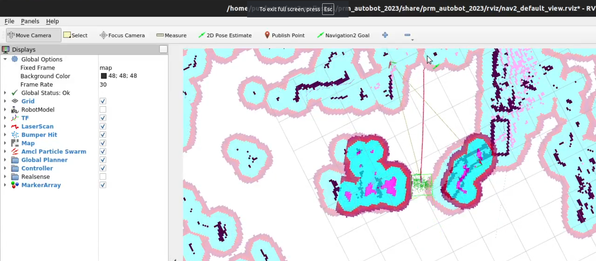

# Using the Navigation2 Stack
1. The nav stack uses a pre-scanned map of the environment to localize the robot and navigate to goals. Ensure you are using the right map inside of `prm_autobot_2023/launch/autobot_launch.py` under `declare_map_yaml_cmd`. I have one pre-scanned for Klondike, you're welcome! 
2. You may also enable/disable launching RViz inside the same file under `declare_use_rviz_cmd` (Rviz basically visualizes the robot's position, the map, and the navigation goals).
3. We have a "watchdog" script which launches all the required ROS2 nodes, and restarts them if they fail to launch. This is because the nodes *do* fail to launch decently often. So the script reads the pipeline's output, looks for specific error messages, and handles them. Launch it with:
    ```bash
    python3 auto-aiming/src/prm_autobot_2023/nav.py
    ```     
    You will know the stack launched successfully when it states `[✔] Navigation startup completed`. If you launched RViz, you should see a window showing the map and the robot's position (the red line is a planned path, you won't see that until you send a goal):
    
4. Give the robot an initial pose so it knows where it is, using the `2D Pose Estimate` tool in RViz. In a real match, this is pre-set in `nav2_params.yaml`.
5. The nav stack will not run unless a match has started. You can simulate starting a match by publishing to the `/match_start` topic:
    ```bash
    ros2 topic pub /match_start std_msgs/msg/Bool "data: true"
    ```
6. The robot will now run the behavior script `subscriber.py`, which will control the robot's movement. The script queues up poses at different configurable times.

# Scanning the Environment to Create a New Map
1. Place the robot at some starting point. Run each of these commands in their own separate terminal:

    ```
    ros2 launch prm_autobot_2023 lidar_control_launch.py
    ros2 launch nav2_bringup navigation_launch.py
    ros2 launch slam_toolbox online_async_launch.py
    ros2 run rviz2 rviz2 -d /opt/ros/humble/share/nav2_bringup/rviz/nav2_default_view.rviz
    ```
2. The robot is now running SLAM to create a map of the environment. You can drive the robot around the area, and Rviz will visualize the map being created. 
3. Once you are satisfied with the map, you can save it by running the following command in a separate terminal:

    ```bash
    ros2 run nav2_map_server map_saver_cli -t /map -f <map_name>
    ```
    To use the new map, change the `declare_map_yaml_cmd` variable in `prm_autobot_2023/launch/autobot_launch.py` to point to the new map's YAML file.


# Once Started, in RViz you can:
* See the map and the robot's position.
* See the robot's LiDAR scan.
* You can localize the robot using “2D Pose Estimate” button.
* Make sure all transforms from odom are present. (odom->base_link->base_scan)
* Send the robot a goal using “Navigation2 Goal” button.